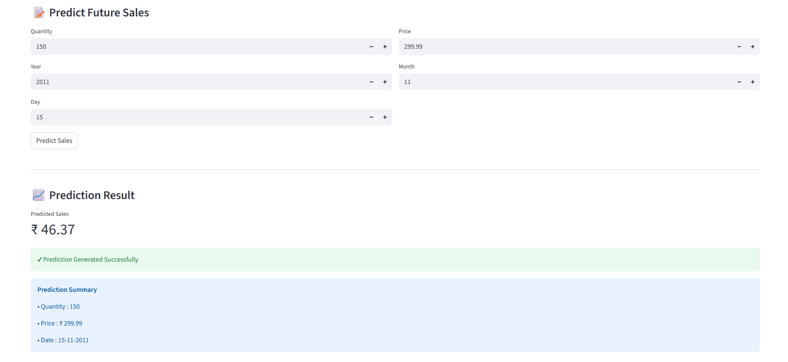
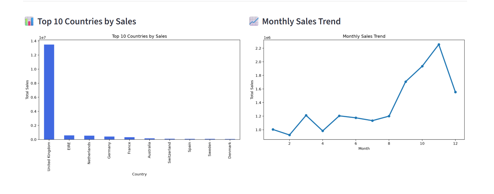
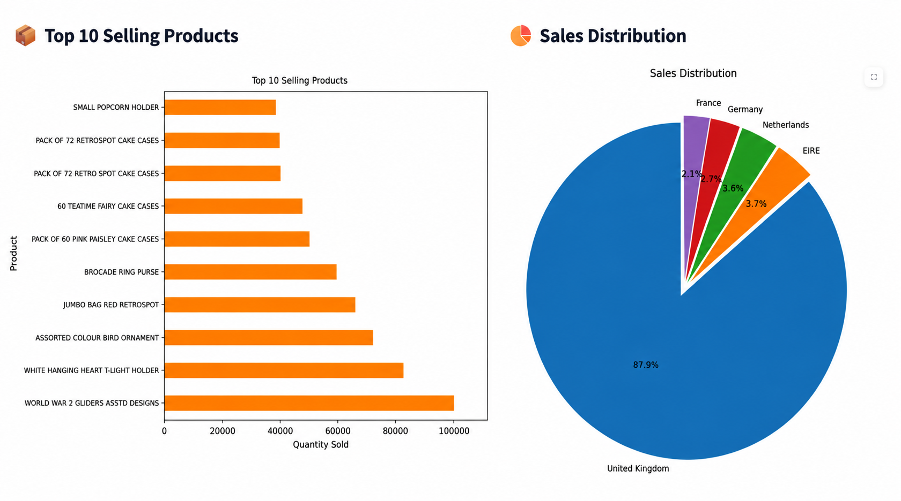

# 📊 Sales Forecasting Dashboard

## 📌 Project Overview

The Sales Forecasting Dashboard is a Machine Learning project that predicts future sales based on historical retail data. The dashboard provides sales predictions and interactive visualizations to help understand sales trends and business performance.

---

## 🚀 Features

- 📈 Predict Future Sales
- 📊 Monthly Sales Trend
- 🌍 Top 10 Countries by Sales
- 📦 Top 10 Selling Products
- 🥧 Sales Distribution by Top 5 Countries
- 📋 Prediction Summary
- 📱 Interactive Streamlit Dashboard

---

## 🛠 Technologies Used

- Python
- Streamlit
- Pandas
- NumPy
- Matplotlib
- Scikit-learn
- Joblib

---

## 📂 Project Structure

```
Foresight_Project/
│
├── Backend/
├── Data/
├── Models/
├── streamlit_app.py
├── requirements.txt
├── README.md
└── .gitignore
```

---

## 📊 Dashboard

The dashboard includes:

- Sales Prediction
- Business KPIs
- Sales Analytics
- Interactive Charts
- Machine Learning Model Prediction

---

## ▶️ How to Run

### 1. Clone Repository

```bash
git clone https://github.com/bhanusri633/Zidio_Foresight_project.git
```

### 2. Install Dependencies

```bash
pip install -r requirements.txt
```

### 3. Run Application

```bash
streamlit run streamlit_app.py
```

---

## 📸 Dashboard Preview

### 🏠 Dashboard Home


---

### 📈 Sales Prediction


---

### 📊 Sales Analytics


---

### 🌍 Product & Country Analysis


---

## 🔮 Future Improvements

- Deep Learning Models
- Real-time Sales Prediction
- Customer Analytics
- Product Recommendation System
- Cloud Deployment

---

## 👩‍💻 Developed By

**Rinika**  
**Bhanusri Dasoju**  
**Purna Harini**  
**Priyanka Shrivastav**


Machine Learning Project using Python & Streamlit.

